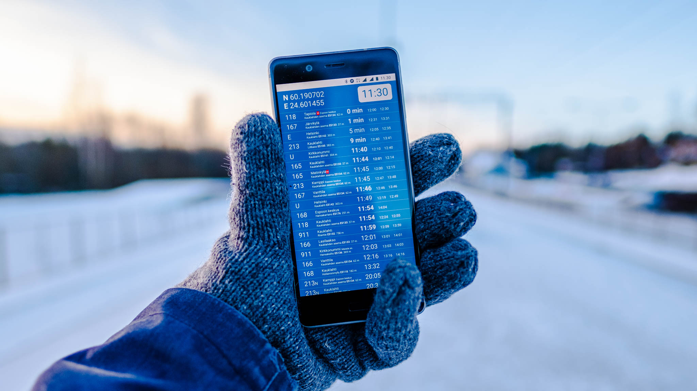

# timetbl


[](https://codeclimate.com/github/kangasta/timetbl/maintainability)
[](https://codeclimate.com/github/kangasta/timetbl/test_coverage)

Simple timetable screen that uses Digitransit API to fetch HSL realtime data and React to render the data. See [digitransit](https://digitransit.fi/en/developers/) for details of the HSL API.



## Usage

For WebApp behaviour navigate to the [served page](https://kangasta.github.io/timetbl/) and enable location.

### Client side routing and query parameters

The WebApp has three main modes, nearby, stop menu, and stop, accessible directly through URLs and configured with query parameters:

Nearby mode shows all nearby departures and is located at `/#/nearby`. Query parameters `lat`, `lon`, and `r` can be used to configure the latitude,longitude, and radius for a nearby query, respectively. For example, `lat=60.198721&lon=24.933413&r=2000` will query nearest departures around Pasila station with radius of 2000m.

Stop menu provides a list of nearby stops with links to each stop mode view and in located at `/#/menu`. The stop menu mode reads the coordinates and radius similarly than the nearby mode.

Stop mode shows departures of specified stop or list of stops and is located at `/#/stop`. The stop code or name is passed in with query parameter `code`. The codes or names are separated with commas if multiple codes or names are given. For example, `code=Karhusaarensolmu` or `code=E2036,E2037`.

In both cases, query parameter `follow=false` can be used to disable the polling of the browser location.

## Development

Application logic is developed under `src/App/` directory. UI components are developed in `src/Components` directory.

### Getting stared

To get development server running on your machine, run:
```bash
# Install dependencies and start dev server
npm install;
npm start;
```

### Before committing

The code is linted and unit tested with:

```bash
# Lint
npm run lint
# or
npm run lint -- --fix
# to also fix automatically fixable errors

# Unit test
npm test
# or
npm test -- --coverage
# to also get coverage analysis
```

To create production build:
```bash
npm install && npm run build;
```
